# 218print journal

**Total Time Spent: 19.5 Hours**

---

## 7/27/2025 — Introduction & Planning  
**Time Spent:** 7 Hours

As an introduction to both hardware and 3D printing, I began by exploring different 3D printer designs: Delta, CoreXY, and Bed Slinger. I chose the Bed Slinger for its simplicity, safety, and ease of construction — ideal for a first build.

My priorities were low cost and high accuracy, so I equipped all axes (X, Y, and Z) with V-slot rails, which offer both affordability and modularity. The Z-axis was driven vertically using a lead screw actuator for smooth, stable motion.

For the extruder, I selected a direct-drive X-carriage system paired with an E3D V6 Volcano hotend — both affordable and reliable. I also added a proximity sensor to enable automatic bed leveling.

- **Print Size:** 300 × 300 × 350 mm  
- **Control Board:** BIGTREETECH SKR MINI E3 V3.0  
  - Chosen for: documentation, cost, and Klipper compatibility  
- **Estimated Total Cost:** ~$325 USD

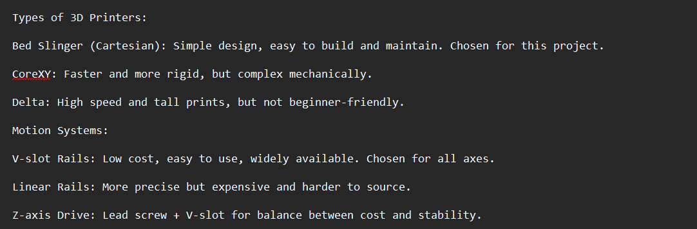

---

## 7/28/2025 — Frame Design in Fusion 360  
**Time Spent:** 3 Hours

This was my first time using Fusion 360, so progress was initially slow. I designed the printer frame using 2040 aluminum V-slot extrusions for added rigidity, with final dimensions of 420 × 640 × 600 mm.

I used a combination of corner brackets and T-plates to reinforce joints, especially on the X-axis, which supports the frequently-moving print head.

---

## 7/29/2025 — Mechanical Endstops & Bed Mount  
**Time Spent:** 1 Hour

I designed custom mechanical endstops triggered by the linear rail carriage — one for the X-axis (print head) and one for the Y-axis (bed).

Finding quality heated beds in Egypt was difficult and expensive, so I designed my own and used 4 mm acrylic sheets, CNC cut.

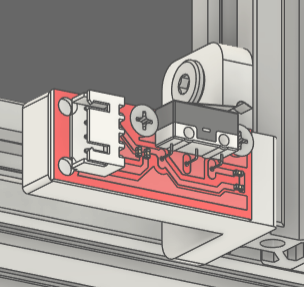  
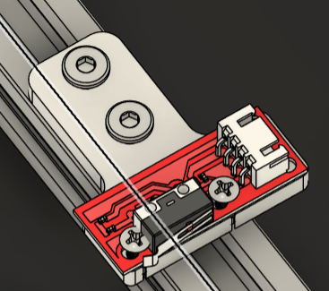  
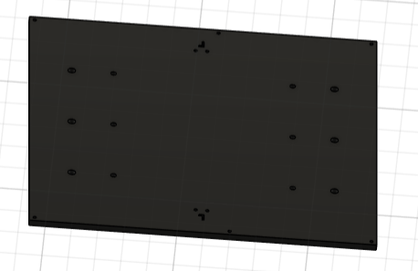

---

## 7/30/2025 — Y-Axis Assembly  
**Time Spent:** 2 Hours

I completed the Y-axis and added 12 V-wheels to the bed mount, which is connected to a belt driven by a stepper motor. I also added spacers to support the frame and elevate the structure.

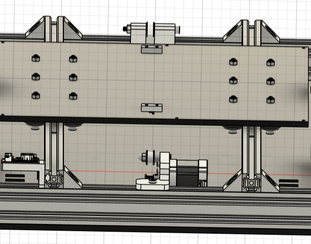

---

## 7/31/2025 — Z-Axis & Structural Reinforcement  
**Time Spent:** 4 Hours

I completed the Z-axis design using custom 3D-printed plates instead of universal aluminum mounts, reducing both weight and cost.

The Z-axis uses a lead screw and V-slot rails, with proper alignment to minimize wobble. Despite supporting the relatively heavy print head, the design remains stable. One plate holds the endstop and stepper motor (which feeds filament), while the opposite side is purely for motion.

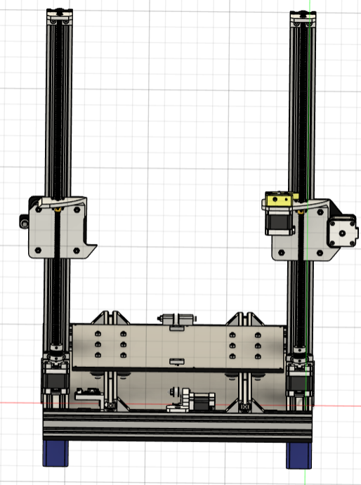   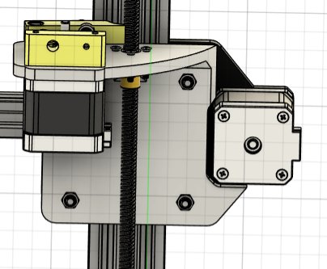  
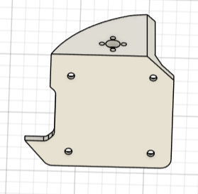   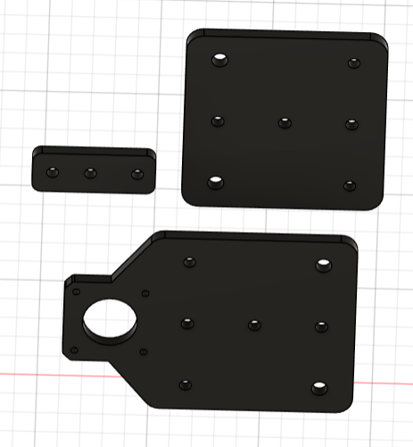

---

## 8/1/2025 — X-Axis & Print Head  
**Time Spent:** 3 Hours

I finalized the X-axis and print head assembly. The direct-drive extruder, Volcano hotend, and proximity sensor were mounted. I also added belt clamps and tensioners for the X-axis. Final adjustments ensured correct nozzle alignment with the print bed center.

I added a support beam connecting the top of the extrusion frame to increase rigidity and durability.

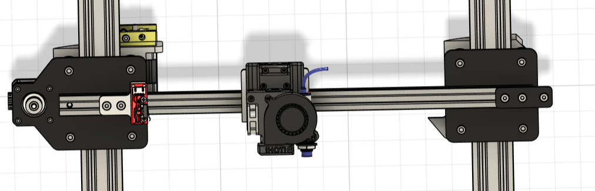  
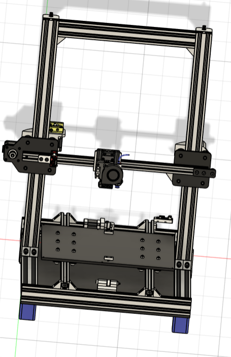
