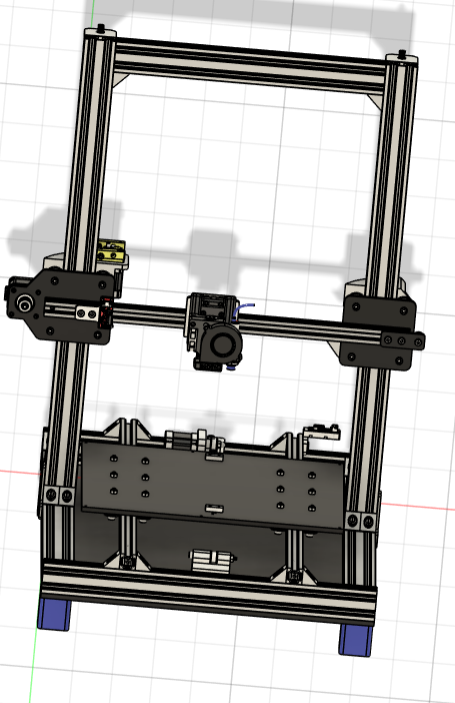

## 218print

218print is a simple bedslinger 3d printer designed to be as cheap as possible. I wanted to do this project because I don't know about 3d printers and I hoped to have one, so it was like a challenge to build it. I used3d printed parts in the motion of z-axis to be cheaper than universal plates.

  
  
  

  this is my BOM file: 
  https://docs.google.com/spreadsheets/d/1YMHhHpfrs8DgpCIIZugQnNaR5hrPWCmoNuoNPDEoR1U/edit?usp=sharing

# Bill of Materials (BOM)

| Qty | Component | Price (EGP) | Total Price | Price (USD) | Link |
|-----|-----------|--------------|--------------|--------------|------|
| 1 | BIGTREETECH SKR MINI E3 V3.0 32 Bit Control Board | 3300 | 3300 | 68.04 | [Link](https://fluxelectronix.com/shop/bigtreetech-skr-mini-e3-v3-0-32-bit-control-board/) |
| 1 | Proximity Sensor - LJ12A3-4-Z-BX | £120.00 | £120.00 | 2.47 | [Link](https://lancer3d.com/product/proximity-sensor-lj12a3-4-z-bx/) |
| 2 | Mechanical End Stop Module | £25.00 | £50.00 | 1.03 | [Link](https://www.ram-e-shop.com/shop/kit-3d-1003-3d-printer-mechanical-end-stop-switch-module-for-ramps-sku-3d1003-7267) |
| 2 | Fan 4040 -- 24v | £35.00 | £70.00 | 1.44 | [Link](https://lancer3d.com/product/fan-4040-12v/) |
| 1 | 5015 Blower Fan -- 24v | £60.00 | £60.00 | 1.24 | [Link](https://lancer3d.com/product/5015-turbo-blower-fan-24-v-50x50x15mm/) |
| 1 | E3d V6 Hotend Full Kit | £325.00 | £325.00 | 6.70 | [Link](https://fluxelectronix.com/shop/e3d-v6-j-head-hotend-1-75mm-extruder-nozzle-0-4mm) |
| 1 | 214x214 3mm Aluminium | 290 | 290 | 5.98 | [Link](https://fluxelectronix.com/shop/3d-printer-mk3-aluminum-heatbed-214x214x3mm-dual-supply/) |
| 1 | Power Supply SMPS 20A 24V | £1,250.00 | £1,250.00 | 25.77 | [Link](https://fluxelectronix.com/shop/power-supply-smps-480w-24v-20a-hq/) |
| 1 | AC Inlet Power Socket with Fuse Holder | £15.00 | £15.00 | 0.31 | [Link](https://fluxelectronix.com/shop/panel-mount-ac-inlet-power-socket-with-fuse/) |
| 1 | Power Supply Cable | £30.00 | £30.00 | 0.62 | [Link](https://fluxelectronix.com/shop/ac-power-cord-with-iec-c13-connector/) |
| 1 | Zip Ties (100 pcs) | - | - | 0 | Already owned |
| 1 | NTC 100K Ohm Thermistor | £30.00 | £30.00 | 0.62 | [Link](https://fluxelectronix.com/shop/100k-ohm-ntc-thermistors-temperature-sensor-with-cable-for-3d-printer-2pin-dupont-head/) |
| 1 | 32GB Micro SD Memory Card HC10 | 375 | 375 | 7.73 | [Link](https://www.ram-e-shop.com/ar/shop/micro-sd-32gb-krt-mymwry-mykrw-32-jyj-hc10-6298) |
| 1 | Raspberry Pi Zero 2 W | 2100 | 2100 | 43.30 | [Link](https://www.ram-e-shop.com/ar/shop/raspberry-pi-zero-2w-raspberry-pi-zero-2-w-9256) |
| - | Mechanical | - | - | 0 | - |
| 5 | 2040 V-slot (34cm) | 300 | £1,500.00 | 30.93 | [Link](https://fluxelectronix.com/shop/2040-v-slot-aluminum-profile-extrusion-1m-black-anodized/) |
| 2 | 2040 V-slot (42cm) | - | - | 0 | - |
| 1 | 2040 V-slot (64cm) | - | - | 0 | - |
| 2 | 2040 V-slot (60cm) | - | - | 0 | - |
| 2.5 | 2020 V-slot (46cm) | 160 | £400.00 | 8.25 | [Link](https://www.juthour-tech.com/en/v-slot-20x20-linear-rail) |
| 1 | 2020 V-slot (68cm) | - | - | 0 | - |
| 22 | 2040 Corner Bracket | 20 | £440.00 | 9.07 | [Link](https://lancer3d.com/product/corner-bracket-for-20x40/) |
| 4 | Steel Flat T-Joint Plate | 25 | £100.00 | 2.06 | [Link](https://lancer3d.com/product/t-corner-mount-bracket/) |
| 2 | Corner Bracket 20x20 | 15 | £30.00 | 0.62 | [Link](https://lancer3d.com/product/corner-angle-20x20/) |
| 23 | Solid V-Wheel | 45 | £1,035.00 | 21.34 | [Link](https://fluxelectronix.com/shop/delrin-v-wheel/) |
| 3 | GT2 Timing Belt (X-axis, 1.5m) | 45 | £135.00 | 2.78 | [Link](https://ampere-electronics.com/product/gt2-open-belt-6mm-wide-pu-with-steel-core-1-meter-black/) |
| 1 | GT2 Timing Belt (Y-axis, 1.5m) | - | - | 0 | - |
| 90 | M5 Slide T-Nuts | 3.5 | £315.00 | 6.49 | [Link](https://ampere-electronics.com/product/m5-sliding-tee-nut-for-2020-profile/) |
| 2 | GT2 Pulley 20T 5mm | 30 | £60.00 | 1.24 | [Link](https://fluxelectronix.com/shop/20teeth-gt2-timing-belt-pulley-5mm-bore/) |
| 3 | GT2 Toothless Pulley 5mm | 35 | £105.00 | 2.16 | [Link](https://fluxelectronix.com/shop/toothless-gt2-idler-pulley-5mm-bore/) |
| 4 | Leveling Screw (M3x40) | 12.5 | £50.00 | 1.03 | [Link](https://ampere-electronics.com/product/leveling-kit-m3-screw-spring-knob-for-3d-printer/) |
| 5 | Nema17 Stepper Motor 17HS4401S – 38mm | £450.00 | £2,250.00 | 46.39 | [Link](https://fluxelectronix.com/shop/nema17-stepper-motor-17hs4401s-38mm/) |
| 1 | MK8 Remote Extruder Kit | 105 | £105.00 | 2.16 | [Link](https://ampere-electronics.com/product/mk8-remote-extruder-aluminum-frame-clamp-block-diy/) |
| 2 | Flexible Coupler 5x8mm | 40 | £80.00 | 1.65 | [Link](https://ampere-electronics.com/product/5x8mm-flexible-shaft-coupler/) |
| 1 | TR8x8 Lead Screw – 1200mm | 310 | £310.00 | 6.39 | [Link](https://ampere-electronics.com/product/tr8x8-acme-lead-screw-1200mm/) |
| 2 | TR8x8 Lead Screw Copper Nut | 30 | £60.00 | 1.24 | [Link](https://fluxelectronix.com/shop/tr8x8-acme-leadscrew-copper-nut/) |
| 10 | M5 Drop-in T-Nut | 3 | £30.00 | 0.62 | [Link](https://ampere-electronics.com/product/m5-drop-in-tee-nut-for-2020-aluminum-profile/) |
| 1 | M3x10mm Screw | - | - | 0 | Already owned |
| 1 | M3x15mm Screw | - | - | 0 | Already owned |
| 1 | M3x20mm Screw | - | - | 0 | Already owned |
| 1 | M3x25mm Screw | - | - | 0 | Already owned |
| 1 | M3 Standard Nut | - | - | 0 | Already owned |
| 1 | M5 Flat Head Screw 10mm | - | - | 0 | Already owned |
| 1 | M5 Flat Head Screw 12mm–15mm | - | - | 0 | Already owned |
| 1 | M5 Flat Head Screw 25mm | - | - | 0 | Already owned |
| 1 | M5 Flat Head Screw 30mm | - | - | 0 | Already owned |
| 1 | M5 Flat Head Screw 35mm | - | - | 0 | Already owned |
| 1 | M5 Flat Head Screw 40mm | - | - | 0 | Already owned |
| 12 | 6mm M5 Eccentric Spacer | 5 | £60.00 | 1.24 | [Link](https://ampere-electronics.com/product/aluminum-spacer-5-1x10x6mm/) |
| 10 | 3mm M5 Spacer | 3 | £30.00 | 0.62 | [Link](https://ampere-electronics.com/product/aluminum-spacer-5-1x10x3mm/) |
| 2 | 6mm M5 Spacer | 5 | £10.00 | 0.21 | [Link](https://ampere-electronics.com/product/aluminum-spacer-5-1x10x6mm/) |
| 20 | 9mm M5 Spacer | 7 | £140.00 | 2.89 | [Link](https://ampere-electronics.com/product/aluminum-spacer-5-1x10x9mm/) |
| 350g | 3D Printing Filament (EGP 4/g) | 3 | £1,050.00 | 21.65 | Will print in Flux |
| 1 | 1/4 Acrylic Sheet(0.5 m square) | 650 | £650.00 | 13.40 | - |

---

**Total Price:**  
- **EGP:** 10,257  
- **Total EGP:** £16,960.00  
- **USD:** $349.69
